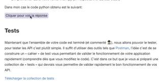

# Click To Reveal Plugin

This plugin enable « Click to Reveal » functionnality to your GitBook.



## Usage

Quick use :

```

Your element to **hide**

```

With custom text :

```

Your element to **hide**

```